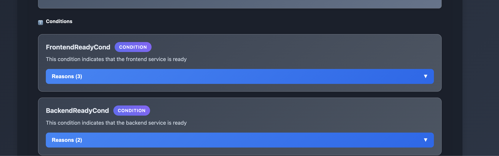
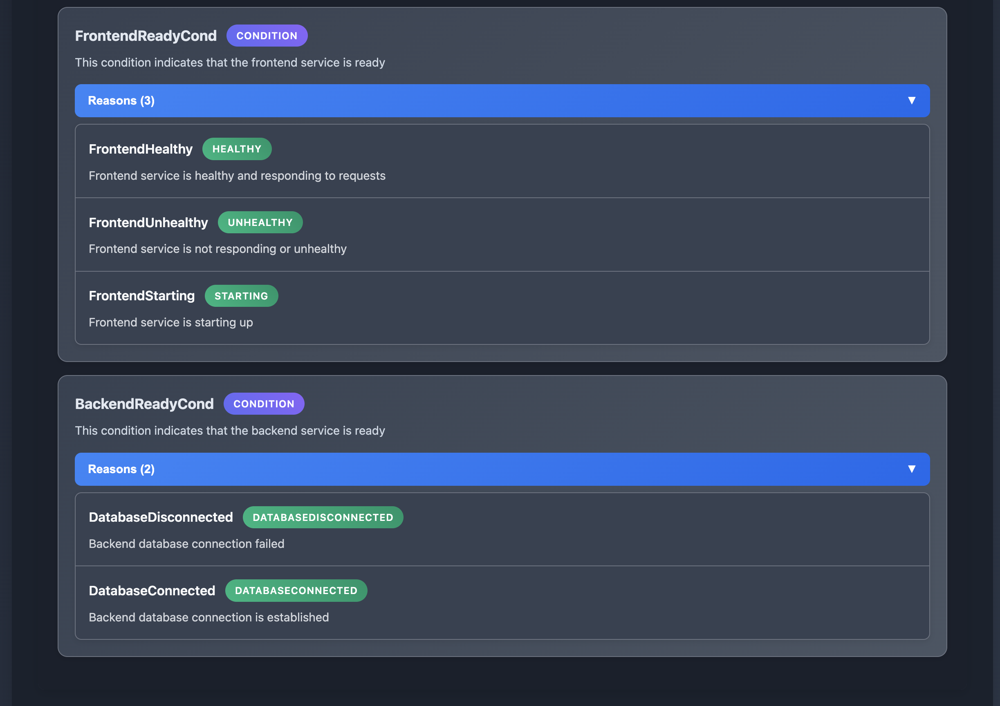

# CRD Condition Annotations

## Overview

The condition annotation feature allows you to document operator conditions and their reasons directly in your Go type files using special comments.
These annotations are then parsed and included in the HTML output generated.

The `--api` flag works with any input type (files, URLs, Git repositories, folders, Kubernetes clusters).

## Annotation Syntax

### Condition Annotation
```go
// +cty:condition:for:MyCRD
// Description of what this condition represents
MyConditionType = "MyCondition"
```

### Reason Annotation
```go
// +cty:reason:for:MyCRD/MyCondition
// Description of what this reason represents
MyReasonType = "ReasonValue"
```

## Example Usage

### types.go
```go
package v1alpha1

// AppConditionType defines the condition types for App CRD
type AppConditionType string

const (
	// +cty:condition:for:App
	// This condition indicates that the frontend service is ready
	FrontendReadyCond AppConditionType = "FrontendReady"

	// +cty:condition:for:App
	// This condition indicates that the backend service is ready
	BackendReadyCond AppConditionType = "BackendReady"
)

// FrontendReadyReason defines reasons for FrontendReady condition
type FrontendReadyReason string

const (
	// +cty:reason:for:App/FrontendReady
	// Frontend service is healthy and responding to requests
	FrontendHealthy FrontendReadyReason = "Healthy"

	// +cty:reason:for:App/FrontendReady
	// Frontend service is not responding or unhealthy
	FrontendUnhealthy FrontendReadyReason = "Unhealthy"

	// +cty:reason:for:App/FrontendReady
	// Frontend service is starting up
	FrontendStarting FrontendReadyReason = "Starting"
)

// BackendReadyReason defines reasons for BackendReady condition
type BackendReadyReason string

const (
	// +cty:reason:for:App/BackendReady
	// Backend database connection is established
	DatabaseConnected BackendReadyReason = "DatabaseConnected"

	// +cty:reason:for:App/BackendReady
	// Backend database connection failed
	DatabaseDisconnected BackendReadyReason = "DatabaseDisconnected"
)
```

And the corresponding CRD type:

### app_crd.yaml
```yaml
apiVersion: apiextensions.k8s.io/v1
kind: CustomResourceDefinition
metadata:
  name: apps.example.com
spec:
  group: example.com
  versions:
  - name: v1alpha1
    served: true
    storage: true
    schema:
      openAPIV3Schema:
        type: object
        properties:
          spec:
            type: object
            properties:
              frontend:
                type: object
                properties:
                  image:
                    type: string
              backend:
                type: object
                properties:
                  database:
                    type: string
          status:
            type: object
  scope: Namespaced
  names:
    plural: apps
    singular: app
    kind: App
```

## Usage

To generate HTML output with condition documentation using the `--api` flag:

```bash
# From a single CRD file with API types in separate folder
cty generate crd --crd ./app-crd.yaml --api ./api/v1alpha1 --format html --output app-docs.html

# From a URL with local API types
cty generate crd --url https://raw.githubusercontent.com/example/crds/main/app-crd.yaml --api ./api/v1alpha1 --format html --output app-docs.html

# From a Git repository with API types in local folder
cty generate crd --git-url https://github.com/example/operator --api ./local-api-types --format html --output app-docs.html

# From Kubernetes cluster with local API types
cty generate crd --kube apps.example.com --api ./api/v1alpha1 --format html --output app-docs.html

# From a folder (both CRDs and API types in same or different folders)
cty generate crd --folder ./crds --api ./api/v1alpha1 --format html --output app-docs.html
```

The `--api` flag points to a folder containing your Go API type definitions with condition annotations.

## HTML Output

Example HTML output:


