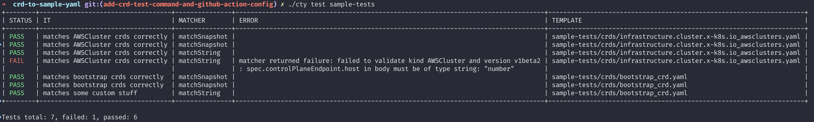
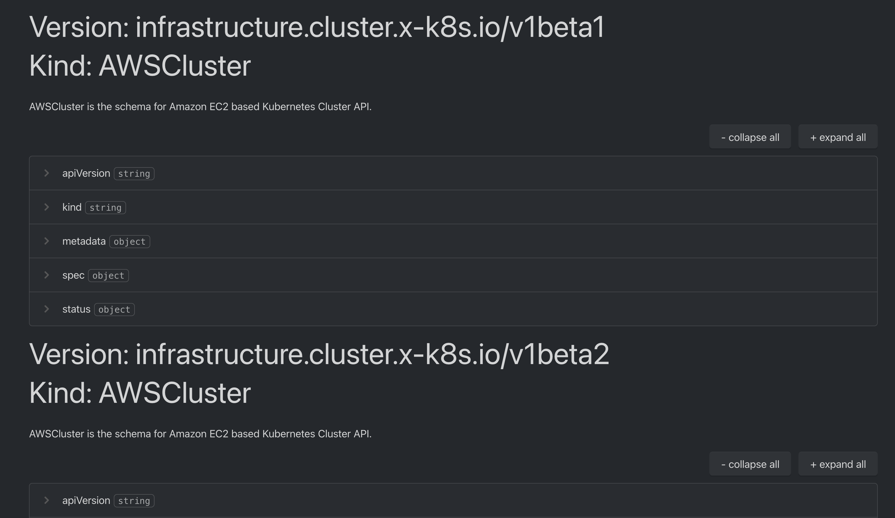
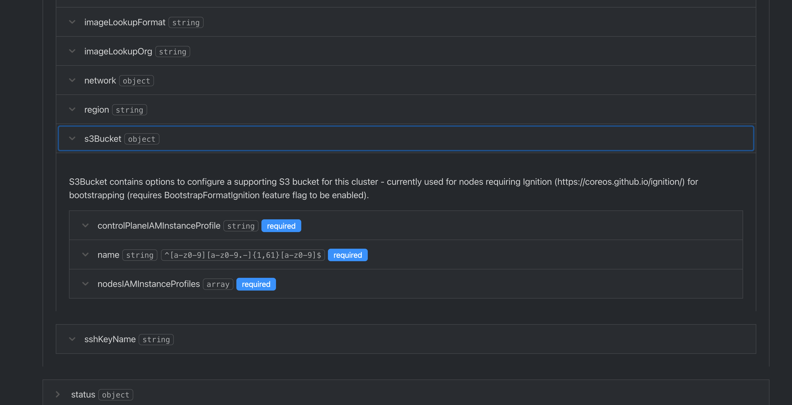
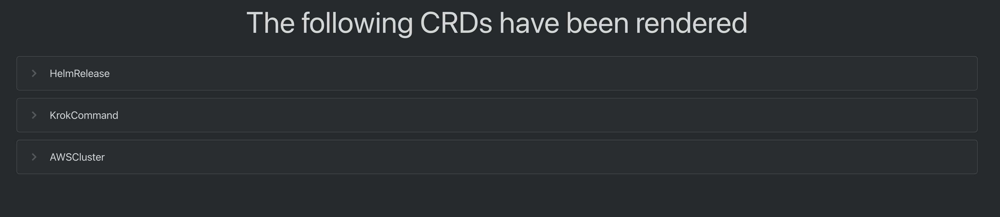
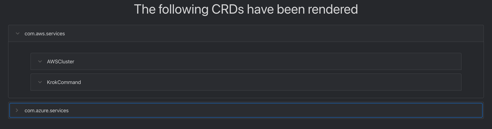
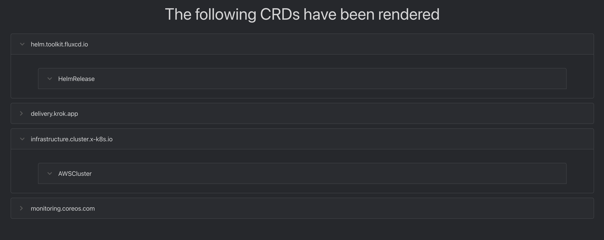
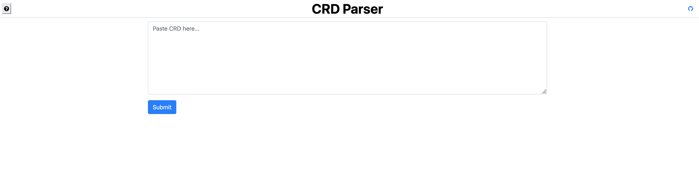
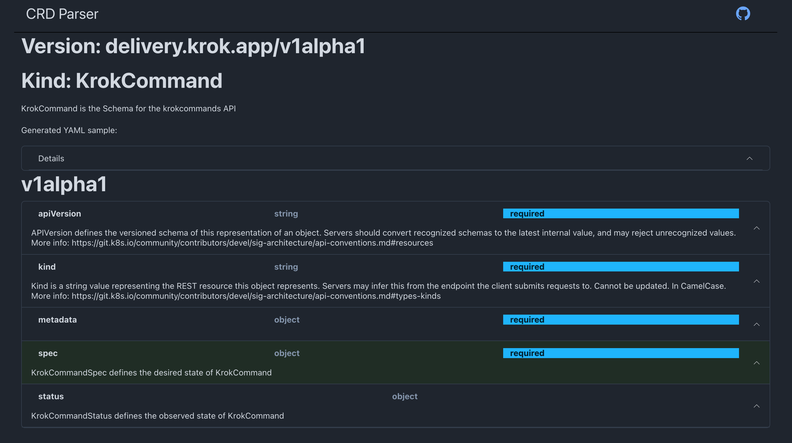
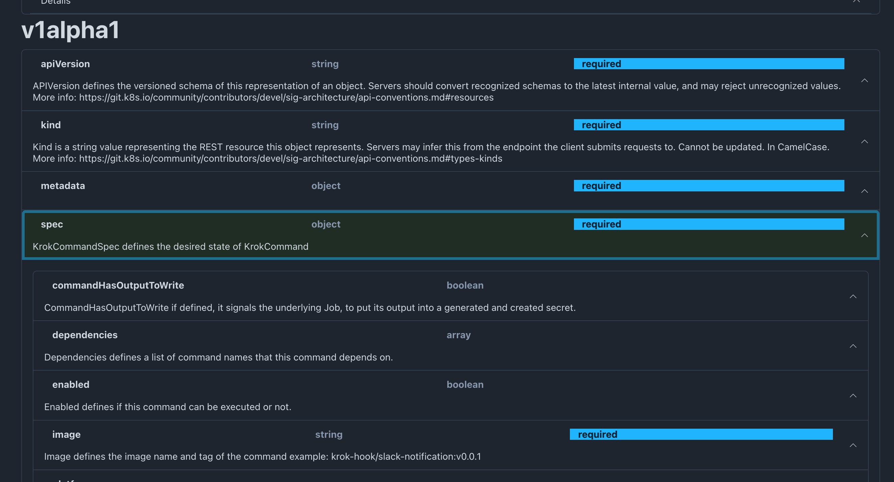
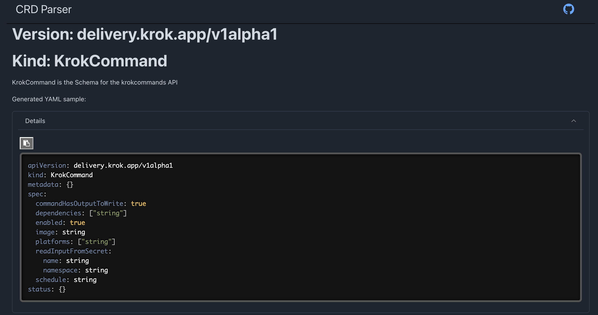

# crd-to-sample-yaml or cty ( city )


Generate a sample YAML file from a CRD definition.

## Dynamic CRD Parsing on the frontend


## CRD Testing using CTY

For more information about how to use `cty` for helm-like unit testing your CRD schemas,
please follow the [How to test CRDs with CTY Readme](./crd-testing-README.md).



## Getting started

- Prerequisites: Go installed on your machine. (Check out this link for details: https://go.dev/doc/install)
- Clone the repository
- Execute `make build` to build the binary

Now you can simply run:

```
cty generate crd -c delivery.krok.app_krokcommands
```

Optionally, define a URL at which a CRD is located:

```
cty generate crd -u https://raw.githubusercontent.com/kubernetes-sigs/cluster-api-provider-aws/main/config/crd/bases/infrastructure.cluster.x-k8s.io_awsclusters.yaml
```

`cty` does not support authentication modes, therefore the CRD needs to be publicly accessible.

This will result in a file similar to this:

```yaml
apiVersion: delivery.krok.app/v1alpha1
kind: KrokCommand
metadata: {}
spec:
  commandHasOutputToWrite: true
  dependencies: ["string"]
  enabled: true
  image: string
  platforms: ["string"]
  readInputFromSecret:
    name: string
    namespace: string
  schedule: string
status: {}
```

A single file will be created containing all versions in the CRD delimited by `---`.

Optionally, you can provide the flag `-s` which will output the generated content to `stdout`.

You can also point at a git repository to _discover_ CRDs inside the repository. Simply call `crd` with:

```
➜ cty generate crd -g https://github.com/Skarlso/crd-bootstrap
Discovered number of CRDs:  1
```

The following authentication methods are available:
- username and password
```
./cty generate crd -g https://github.com/Skarlso/crd-bootstrap --username skarlso --password password
```
- token
```
./cty generate crd -g https://github.com/Skarlso/crd-bootstrap --token token
```
- SSH with provided private key
```
./cty generate crd -g https://github.com/Skarlso/crd-bootstrap --private-ssh-key-file ~/.ssh/main-key
```
- SSH by using the local ssh-agent
```
./cty generate crd -g https://github.com/Skarlso/crd-bootstrap --ssh-agent
```

Further certificate bundles can be provided for privately hosted git servers with `--ca-bundle-file`.

### HTML output

It's possible to generate a pre-rendered HTML based output for self-hosting what the website produces online.

To get an HTML output provide the format flag like this:

```
cty generate crd -c delivery.krok.app_krokcommands --comments --format html
```




In case of multiple CRD files being parsed using a `folder` target, the CRDs will be listed
in collapsed drop-down menus where their KIND is the title.



### Minimal required CRD sample

It's possible to generate a sample YAML for a CRD that will make the CRD validation pass. Meaning, it will only contain
samples for fields that are actually required. All other fields will be ignored.

For example, a CRD having a single required field with an example and the rest being optional would generate something
like this:

```yaml
apiVersion: delivery.krok.app/v1alpha1
kind: KrokCommand
spec:
  image: "krok-hook/slack-notification:v0.0.1"
```

To run cty with minimal required fields, pass in `--minimal` to the command like this:

```
cty generate crd -c delivery.krok.app_krokcommands --comments --minimal --format html
```

### Folder source

To parse multiple CRDs in a single folder, just pass in the whole folder like this:

```
cty generate crd -r folder
```

Any other flag will work as before.

### Config File

It's possible to define a config file that designates groups for various rendered CRDs.

To use a config file, set the switch `--config`. A sample config file could look something like this:

```yaml
apiGroups:
  - name: "com.aws.services"
    description: "Resources related to AWS services"
    files: # files and folders can be defined together or on their own
      - sample-crd/infrastructure.cluster.x-k8s.io_awsclusters.yaml
      - sample-crd/delivery.krok.app_krokcommands
  - name: "com.azure.services"
    description: "Resources related to Azure services"
    folders:
      - azure-crds
```



If no grouping information is provided, the rendered CRD's group version is used.



## Schema Generation

`cty` also provides a way to generate a JSON Schema out of a CRD. Simply use:

```
cty generate schema -c sample-crd/delivery.krok.app_krokcommands.yaml
```

to target a single file. Or

```
cty generate schema -r sample-crd
```

to target a folder.

## CRD Types

ANY kind of type can be used, not just `CustomResourceDefinitions` as long as they provide the following structure:

```yaml
# top level spec field
spec:
  names:
    kind: # this should be the kind of the generated object
  group: # the group of the generated object
  # optional version field 
  versions:
    - name: v1alpha1
      # OpenAPI schema (like the one used by Kubernetes CRDs). Determines what fields
      # the XR (and claim) will have. Will be automatically extended by crossplane.
      # See https://kubernetes.io/docs/tasks/extend-kubernetes/custom-resources/custom-resource-definitions/
      # for full CRD documentation and guide on how to write OpenAPI schemas
      schema:
        openAPIV3Schema:
  # optional validation field describing all versions
  validation:
    openAPIV3Schema:
```

If these fields are respected, the apiVersion or the kind of the resource doesn't matter. It's all unstructured in the
background.

## WASM frontend

There is a WASM based frontend that can be started by navigating into the `wasm` folder and running the following make
target:

```shell
make run
```

This will start a front-end that can be used to paste in and parse CRDs.

## Shareable Link

It's possible to provide a link that can be shared using a url parameter like this:

```
https://crdtoyaml.com/share?url=https://raw.githubusercontent.com/Skarlso/crd-to-sample-yaml/main/sample-crd/infrastructure.cluster.x-k8s.io_awsclusters.yaml
```

Will load the content, or display an appropriate error message.

## Comments

Comments can be added to each line of the generated YAML content where descriptions are available. This looks something
like this:

```yaml
# APIVersion defines the versioned schema of this representation of an object. Servers should convert recognized schemas to the latest internal value, and may reject unrecognized values. More info: https://git.k8s.io/community/contributors/devel/sig-architecture/api-conventions.md#resources
apiVersion: infrastructure.cluster.x-k8s.io/v1beta1
# Kind is a string value representing the REST resource this object represents. Servers may infer this from the endpoint the client submits requests to. Cannot be updated. In CamelCase. More info: https://git.k8s.io/community/contributors/devel/sig-architecture/api-conventions.md#types-kinds
kind: AWSCluster
metadata: {}
# AWSClusterSpec defines the desired state of an EC2-based Kubernetes cluster.
spec:
  # AdditionalTags is an optional set of tags to add to AWS resources managed by the AWS provider, in addition to the ones added by default.
  additionalTags: {}
  # Bastion contains options to configure the bastion host.
  bastion:
  ...
```

To add comments simply run cty with:
```console
cty generate -c sample-crd/infrastructure.cluster.x-k8s.io_awsclusters.yaml --comments
```

The frontend also has a checkbox to add comments to the generated yaml output.

## Templated CRDs

It's possible to provide a templated CRD like this one for flux: [Helm Controller](https://raw.githubusercontent.com/fluxcd-community/helm-charts/main/charts/flux2/templates/helm-controller.crds.yaml).

It contains template definition like:

```yaml
{{- if and .Values.installCRDs .Values.helmController.create }}
```

These are trimmed so that the CRD parses correctly. Any values that might be in-lined are replaced with `replaced`.
This is done to avoid trying to parse a breaking yaml.

Things like this:
```yaml
kind: CustomResourceDefinition
metadata:
  annotations:
    controller-gen.kubebuilder.io/version: v0.15.0
  labels:
    app.kubernetes.io/component: helm-controller
    app.kubernetes.io/instance: {{ .Release.Namespace }}
    app.kubernetes.io/managed-by: {{ .Release.Service }}
    app.kubernetes.io/part-of: flux
    app.kubernetes.io/version: {{ .Chart.AppVersion }}
    helm.sh/chart: '{{ .Chart.Name }}-{{ .Chart.Version | replace "+" "_" }}'
  name: helmreleases.helm.toolkit.fluxcd.io
```

Where some templated value isn't escaped with `'` will create an invalid YAML that fails to parse.

## Showcase



Parsed Yaml output on the website:




