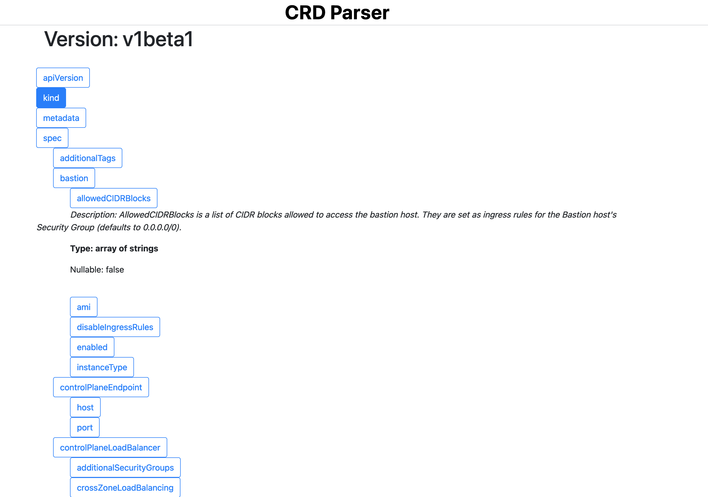

# crd-to-sample-yaml

Generate a sample YAML file from a CRD definition.

Simply run:

```
crd-to-yaml generate -f delivery.krok.app_krokcommands
```

This will result in a file similar to this:

```yaml
apiVersion: delivery.krok.app/v1alpha1
kind: KrokCommand
metadata: {}
spec:
  commandHasOutputToWrite: true
  dependencies: ["string"]
  enabled: true
  image: string
  platforms: ["string"]
  readInputFromSecret:
    name: string
    namespace: string
  schedule: string
status: {}
```

Each version will contain its own file output.

Future plans include generating proper, schema validated values for all fields.

There is also an option to run this as a server. Run:

```
crd-to-yaml serve
```

This will start a front-end that can be used to paste in and parse CRDs.

## Showcase



